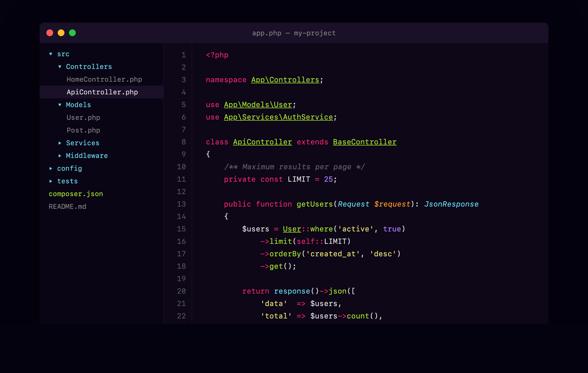

# Spartan Color Scheme

A dark color scheme for Sublime Text with a deep purple-black background and vivid syntax highlighting. Designed for long coding sessions with high readability and minimal eye strain.

## Preview

## Installation

### Package Control (Recommended)

1. Open Command Palette (`Cmd+Shift+P` / `Ctrl+Shift+P`)
2. Select **Package Control: Install Package**
3. Search for **Spartan Color Scheme**
4. Activate: **Preferences > Color Scheme > Spartan**

### Manual

1. Download `Spartan.sublime-color-scheme`
2. Place in `Packages/User/` (Preferences > Browse Packages)
3. Activate: **Preferences > Color Scheme > Spartan**

## Colors

| Role | Color | Hex |
|------|-------|-----|
| Background |  | `#0d0717` |
| Foreground |  | `#ffffffd9` |
| Caret |  | `#ffd800` |
| Comments |  | `#dddddd65` |
| Strings |  | `#e6db74` |
| Keywords |  | `#f92672` |
| Functions/Classes |  | `#a6e22e` |
| Types/Library |  | `#66d9ef` |
| Numbers/Constants |  | `#ae81ff` |
| Parameters |  | `#fd971f` |

## Supported Languages

Full syntax coverage for PHP, JavaScript, TypeScript, HTML, CSS, JSON, YAML, Markdown, SQL, Python, Ruby, Go, and all languages using standard TextMate scopes.

## Credits

- **Author**: [Renzo Johnson](https://renzojohnson.com)
- **License**: MIT
